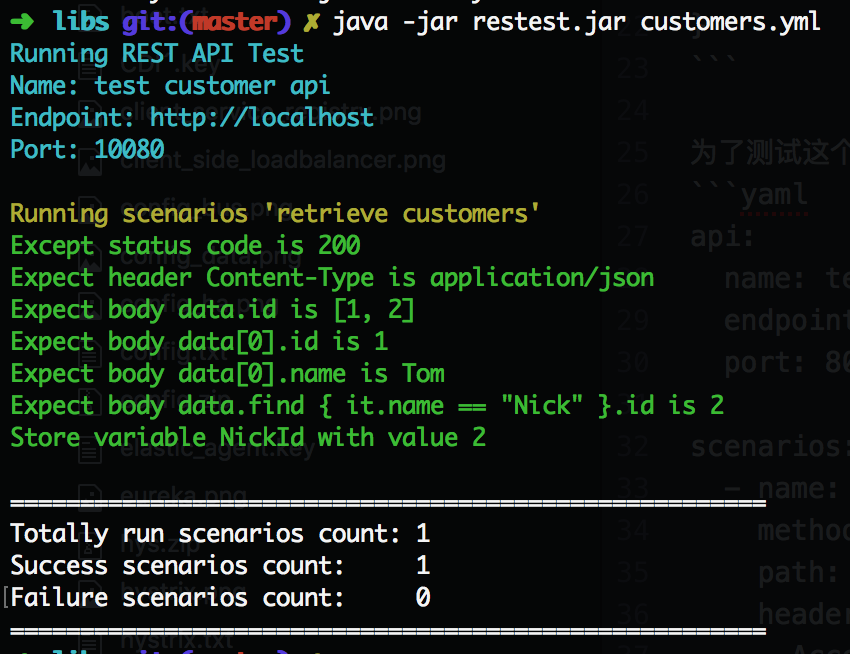
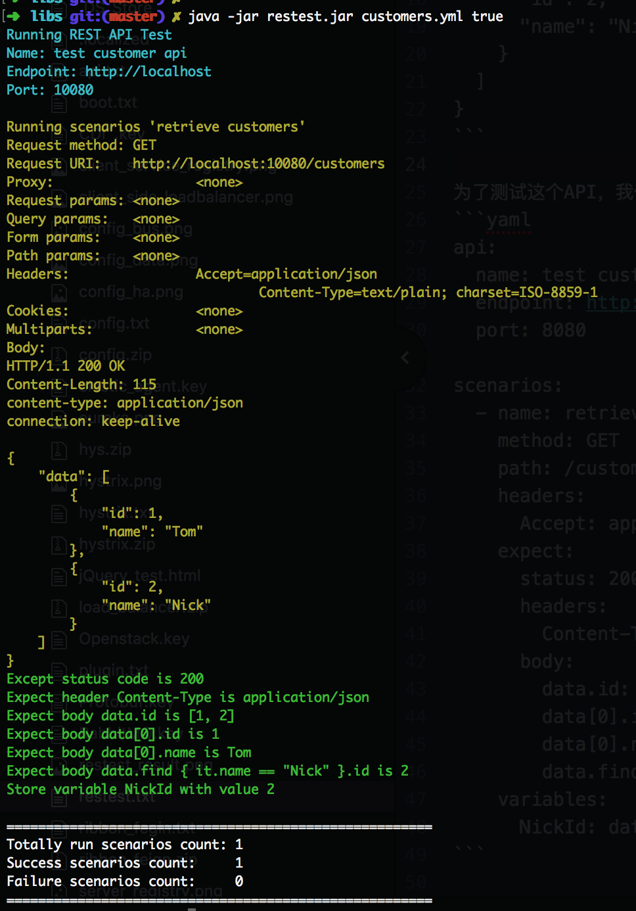

## Restest
Restest is an automation test tool for RESTFul API.
you can use it to test your RESTFul API easily via writing YAML, and it's simple to integrated with CI/CD as well.

[中文版](http://ndrlslz.github.io/2018/09/22/Restest/)

## QuickStart

Assume there is an running RESTFul API like below.
```yaml
Request: GET http://localhost:8080/customers

Response: 
{
  "data": [
    {
      "id": 1,
      "name": "Tom"
    },
    {
      "id": 2,
      "name": "Nick"
    }
  ]
}

```

Define the `definition.yml`, content as below.
```yaml
api:
  name: test customer api
  endpoint: http://localhost
  port: 8080

scenarios:
  - name: retrieve customers
    method: GET
    path: /customers
    headers:
      Accept: application/json
    expect:
      status: 200
      headers:
        Content-Type: application/json
      body:
        data.id: [1, 2]
        data[0].id: 1
        data[0].name: Tom
        data.find { it.name == "Nick" }.id: 2
    variables:
      NickId: data.find { it.name == "Nick" }.id
```

Git clone the code

`./gradlew build`

`cd build/lib`

Run `java -jar restest.jar definition.yml`

Result as per below


## Detailed Documentation
YAML definition are consist of two parts, `API definition` and `Scenarios definition`

### API Definition
API definition describe the basic information of API.

```yaml
api:
  name: # required - your api's name
  endpoint: # required - http://localhost
  port: # required
  username: # optional - basic auth's username
  password: # optional - basic auth's password
```

### Scenarios Definition
Scenarios definition describe all the detailed test cases.

```yaml
scenarios:
  - name: test case one
  ...
  
  
  - name: test case two
  ...
```

#### Syntax

```yaml
scenarios:
  - name: # required - test case name
    path: # required - /path/to/the/resource
    method: # optional - GET by default
    headers: # optional - set the request headers 
      Header-Name: Header-Value
    body: > # optional - set the request body
      {
        "json": "..."
      }
    expect: # optional
      status: # optional - 200 by default
      headers: # optional - expected headers
        Header-Name: Header-Value
      body: # optional - expected body
        id: 1
    variables: # optional - store variables
      Var-Name: Var-Value  
      
```

section `name`, `path`, `method`, `headers`, `body` are used to construct the HTTP request.

section `expect` construct the part of HTTP response you expect.
section `expect.body` use RestAssured library to check the HTTP response. please refer [RestAssured](http://rest-assured.io/) to get more syntax.

section `variables` is used to store the variables from response, it could be retrieved in the following test scenarios.

#### Supported Function
Within section `expect.body`, you are able to use function to check the response, and currently below function are supported.
* contains
* containsString
* endsWith
* startsWith
* hasItems
* greaterThan
* lessThan
* isEmptyOrNullString
* anything

### Command Parameters
`java -jar restest.jar <file location or folder location> [true|false]`

There are two parameters you can provide when run restest.jar.
1. **definition location(required)**: it is either one definition yml file and a folder containing multiple definition yml files.

2. **log verbose(optional)**: enable the verbose log or not. false by default.

Below is an example which open the log verbose.



## Example
You can refer more [examples](examples/example.yml)